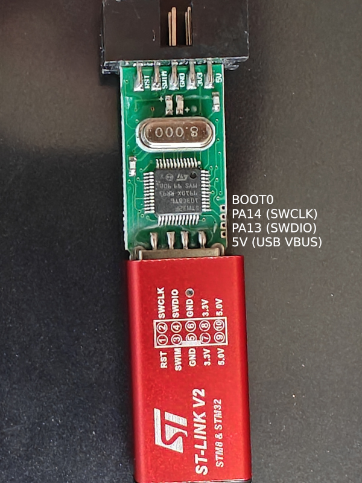
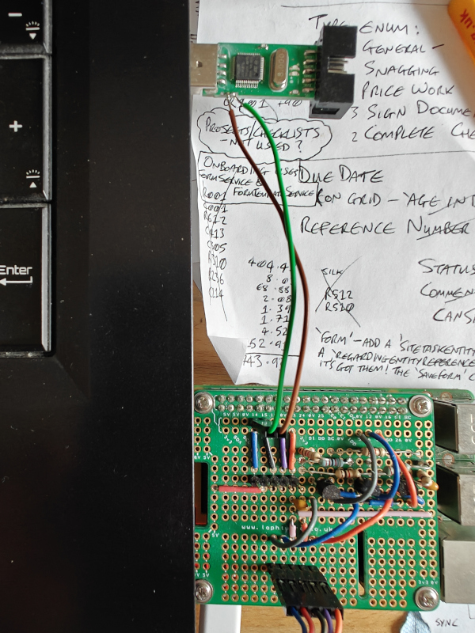

# Re-flashing an _ST-LINK V2_ clone to function as a [Black Magic Probe](https://github.com/blackmagic-debug/blackmagic).

These instructions are for my own reference so are more notes rather than a how-to guide, but if they help others then that's great.  Use at your own risk.

This hack requires a Raspberry Pi, [OpenOCD](https://openocd.org/) and a bit of soldering.

The first step is to take apart the _ST-LINK V2_ clone and see what's inside:

[](cover-off-with-labels-3000x4000.jpg)

They're all different but this particular model has an [STM32F103C8](stm32f103c8.pdf) - officially 64KiB but actually 128KiB (just be sure to verify the images after flashing !)  I've traced the pins to the SWD header (labelled in the image above).

The next step is to attach some flying wires to the `SWDCLK` and `SWDIO` pins.  Power and ground will need to be supplied by the USB port.  Ensure that the Raspberry Pi is also powered by the same port / PC so that there are no potential differences that could interfere with (or damage) the devices, _including (and especially) the very expensive laptop..._

[](ready-for-reflashing-3000x4000.jpg)

The image above includes a HAT I made that allows me to program a variety of PICs using the Raspberry Pi.  The only relevant part for this process is that I have added a new two-pin header (pins `14` and `15`) purely for the purposes of re-flashing the ST-LINK clone.

The next step is to get the [Black Magic Probe](https://github.com/blackmagic-debug/blackmagic) firmware and build it.  These steps will build and install the Black Magic Bootloader as well - this isn't necessary but I bricked the probe on the first attempt because I erased and overwrote the bootloader that came with it.  D'oh.

Locally:
```
$ git clone https://github.com/blackmagic-debug/blackmagic.git
$ cd blackmagic
$ vi cross-file/stlink.ini    # Set bmd_bootloader=true
$ meson setup build --cross-file cross-file/stlink.ini
$ meson compile -C build
$ meson compile -C build blackmagic_stlink_bootloader.bin
$ scp build/blackmagic_stlink_{firmware,bootloader}.bin <RPI_USER>@<RPI_HOST>:
```

On the Pi:
```
$ sudo apt-get install autoconf libtool libusb-dev openocd telnet

$ cat > openocd-arm-swd-bitbang.cfg <<EOF
adapter driver bcm2835gpio

# Raspi1 peripheral_base address
# bcm2835gpio_peripheral_base 0x20000000
# Raspi2 and Raspi3 peripheral_base address
bcm2835gpio_peripheral_base 0x3F000000

# Raspi1 BCM2835: (700Mhz)
# bcm2835gpio_speed_coeffs 113714 28
# Raspi2 BCM2836 (900Mhz):
# bcm2835gpio_speed_coeffs 146203 36
# Raspi3 BCM2837 (1200Mhz):
bcm2835gpio_speed_coeffs 194938 48

# SWD GPIO set: swclk swdio
bcm2835gpio_swd_nums 14 15

transport select swd

# set CHIPNAME nrf52840
# source [find target/nrf52.cfg]
set CHIPNAME stm32f103c8
source [find target/stm32f1x.cfg]

# Uncomment & lower speed to address errors
# adapter_khz 1000

init
targets
reset halt

EOF

$ sudo openocd -f openocd-arm-swd-bitbang.cfg
```

Also on the Pi, but from another session (to communicate with the OpenOCD session started above):
```
$ telnet localhost 4444
reset init
flash erase_address 0x08000000 0x00020000
reset init
flash write_image blackmagic_stlink_firmware.bin 0x08002000
flash verify_image blackmagic_stlink_firmware.bin 0x08002000
flash write_image blackmagic_stlink_bootloader.bin 0x08000000
flash verify_image blackmagic_stlink_bootloader.bin 0x08000000
reset init
```

Unplug and re-insert the device and check that the USB enumeration completes successfully as a Black Magic Probe.

If all went successfully then the flying wires can now be unsoldered and the unit put back together.  Because of the Black Magic Bootloader, updating the firmware in future can be done without the need for the SWD flying wires, like so:
```
$ sudo dfu-util -d 1d50:6018 -s 0x08002000:leave:force -D blackmagic_stlink_firmware.bin
```
